# Polyomino Solver
C++版本的 [Gerard's Polyomino Solver](https://gp.home.xs4all.nl/PolyominoSolver/downloadsolver.htm)，无 GUI。虽然 Gerard's Polyomino Solver 的年代久远，但是其速度较快。例如，在我的笔记本上30分钟内可以穷举完 [Untouchable 11](https://www.gathering4gardner.org/g4g13gift/puzzles/HoffCarl-GiftExchange-FromUntouchable11toHazmatCargo-G4G13.pdf) 的所有可能情况，找到全部7个解只需要20分钟左右，比 [DLX](https://arxiv.org/abs/cs/0011047) 算法还要快。
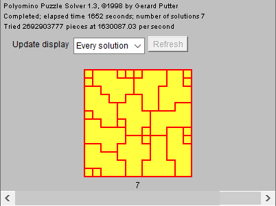
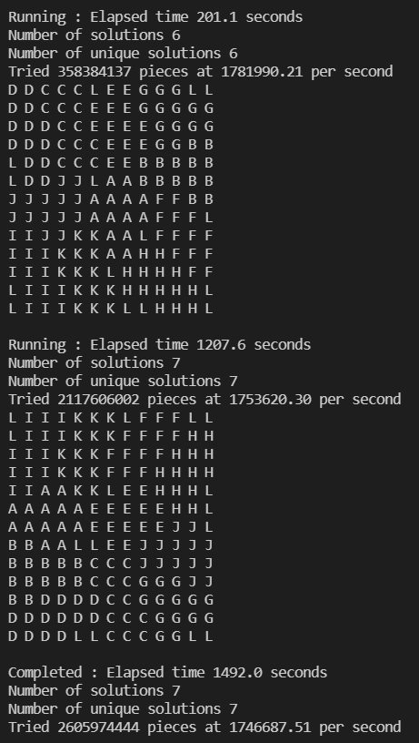

Gerard's Polyomino Solver 是一个 Java applet，需要将待解决问题的配置信息写入 HTML 文件，然后用浏览器打开 HTML 文件，从而启动程序，或者通过 appletviewer 命令启动。通过 `javap -verbose Polyomino.class` 可以查看编译时用的 JDK 版本号 (major version: 45, minor version: 3), 对应 jdk 1.1.8。JDK 版本比较旧，但是 jdk 1.8.0 也能运行该 applet。
使用反编译工具 [jadx](https://github.com/skylot/jadx) 可以得到无注释的近似源代码。处理一些简单的错误后，在 main 函数里面实例化 applet 并且用 JFrame 当容器来显示 applet，从而[转化为普通的 Java 程序](https://www.iteye.com/blog/gg19861207-485225)。修改后的程序可以运行，但是功能没有实现。还是需要理解源代码的逻辑。源码里的变量名用的是荷兰语，一开始还有点别扭。下面根据我自己的理解简单介绍一下 Gerard's Polyomino Solver 的主要思想。

首先说明一下解决拼图/拼板问题的两种思路。第一种思路，重点是每种部件所有可能的放置形态和位置（不考虑其他部件的条件下），然后每种部件选择一种可能进行组合，如果不冲突，就找到了一个解。可通过多层（有多少种部件就需要多少层）循环或者回溯实现。第二种思路，重点是拼板中的每个方块以何种方式覆盖。对于拼板中的某个空方块，选择某种部件某种变换形态的某个方块去覆盖，如果不冲突，则找到拼板中的下一个空方块进行同样的操作。这两种思路可以搭配使用。两种思路都可以通过剪枝进行优化。Gerard's Polyomino Solver 采用第二种思路并且进行了优化：
1. 二维情况下，每种部件通过水平镜像、垂直镜像和转置进行搭配一共有8种变换形态，相同的形态可以只保留一种。
2. 可以选定某种部件作为判断两个解是否等价的依据。对于选定部件的某种变换形态的任意解，如果拼板的该种变换形态和初始形态相同，那么用选定部件的初始形态肯定能搜索到与之等价的解，所以可以删除选定部件的该种变换形态。为了删除更多的变换形态，我们应该选择可删除形态数最多的部件。
3. 按照顺序处理拼板中找到的第一个空方块，这样我们只需要判断每种部件每种变换形态的的第一个方块能否覆盖该空方块就行了，部件的其他方块覆盖该空方块肯定会有冲突。
4. 可以优先处理面积最小的空连通区域。如果存在多个空连通区域，一般情况下，区域面积越小，处理该区域所需的尝试次数越少。搜索最小面积区域的过程中，如果找到了面积比剩余部件中最小方块数还小的区域，可以判断当前已放置的部件无解，避免了很多无效的搜索。当然，搜素最小空连通区域也会增加额外的时间，所以需要根据实际情况选择是否开启。
5. 优先选择自由度最小的空方块进行处理。这种方式不能保证待处理空方块前面没有空方块，所以会增加需要尝试的部件方块数量。为了减轻这个问题的影响，可以预先列举出在空方块周围不同情况下每种部件需要尝试的方块，这样在遇到实际情况时，就不用尝试每种部件的所有方块。

# Untouchable 11
在传统的拼板问题中，部件之间可以接触。但是，Untouchable 11 要求部件之间不能接触，角接触也不允许。有两种方式可以将这种非接触问题转化为传统问题。

第一种方式，以方块边长的一半为单位，将原来的方块变成四个小方块，同时在每个部件和拼板的外围增加一圈小方块。
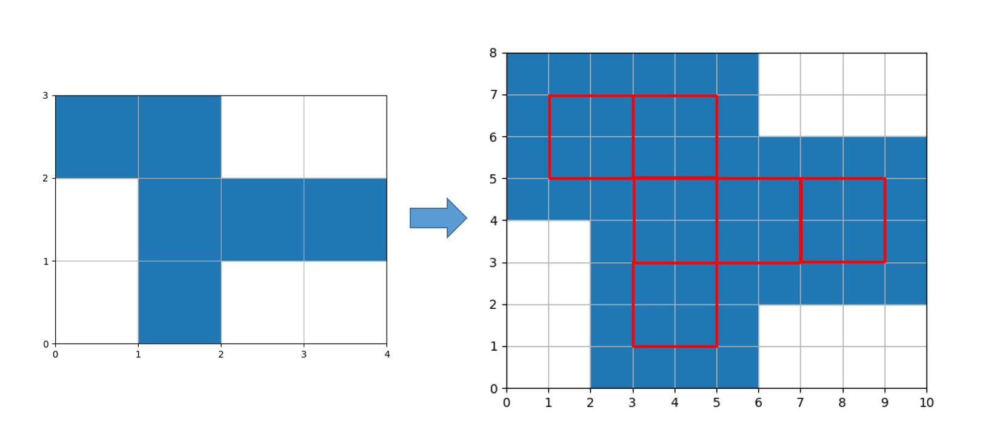

第二种方式，将部件和拼板中方块的四个顶点看成主体，忽略方块，用部件的顶点去覆盖拼板中的顶点。此时顶点之间间隔一个单位就表示顶点之间可以接触。
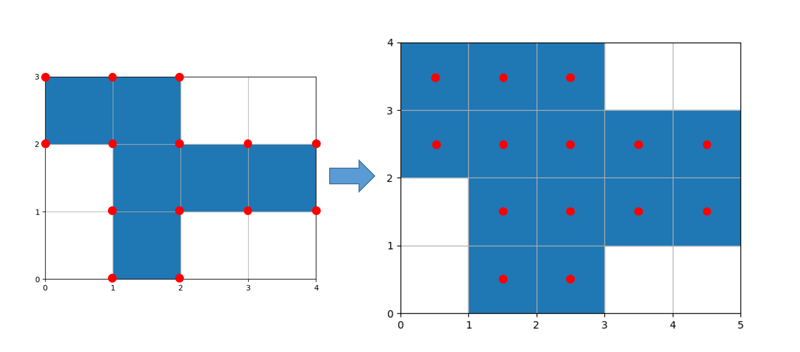

由于第一种方式使问题的规模扩大了，第二种方式几乎没变，所以一般采用第二种方式。经过测试，方式一两个小时都没有找到一个解。

# 编译
Windows

`cl.exe /O2 /EHsc /nologo /utf-8 solver.cpp`

Linux

`g++ -O3 -Wall -o solver solver.cpp`

# 参考资料
- https://gp.home.xs4all.nl/PolyominoSolver/downloadsolver.htm
- https://www.gathering4gardner.org/g4g13gift/puzzles/HoffCarl-GiftExchange-FromUntouchable11toHazmatCargo-G4G13.pdf
- http://www.mattbusche.org/blog/article/polycube/
- https://arxiv.org/abs/cs/0011047
- https://github.com/skylot/jadx
- https://www.iteye.com/blog/gg19861207-485225
- https://www.boost.org/doc/libs/1_33_1/doc/html/hash_combine.html

# 附录
Untouchable 11 第二种转化方式的7个解以及解析后的结果

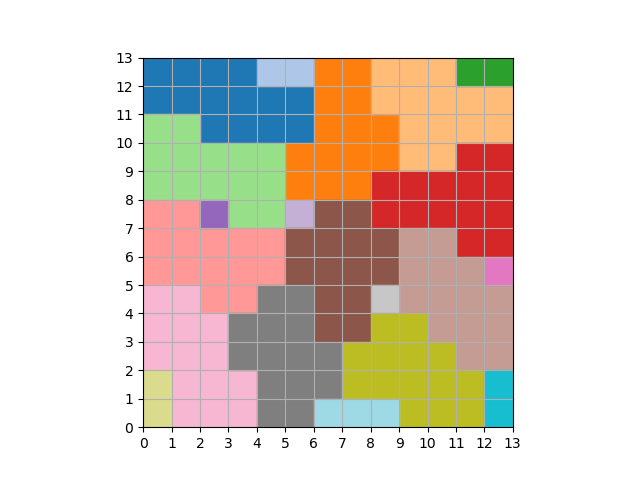
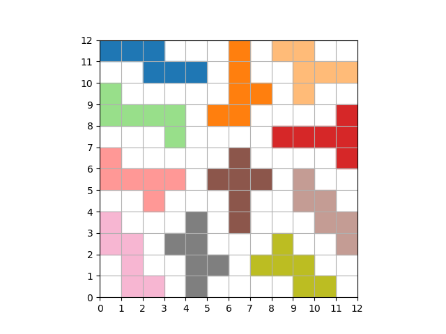
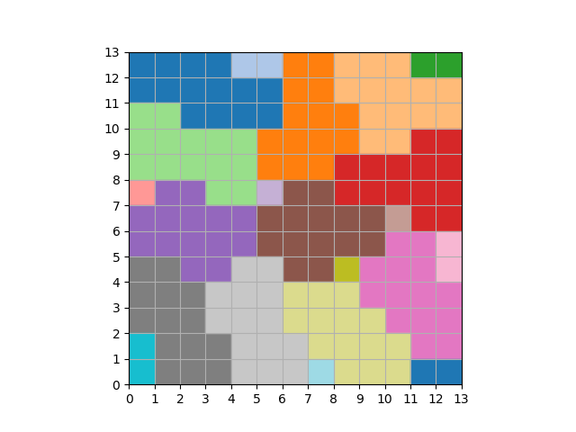
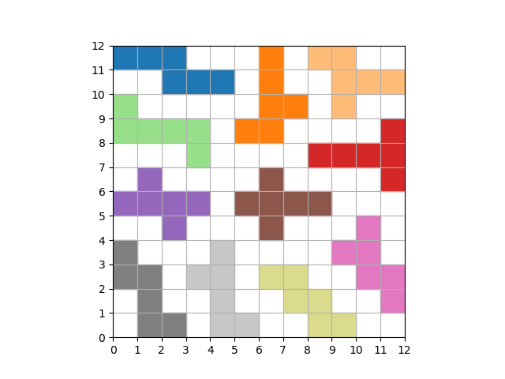
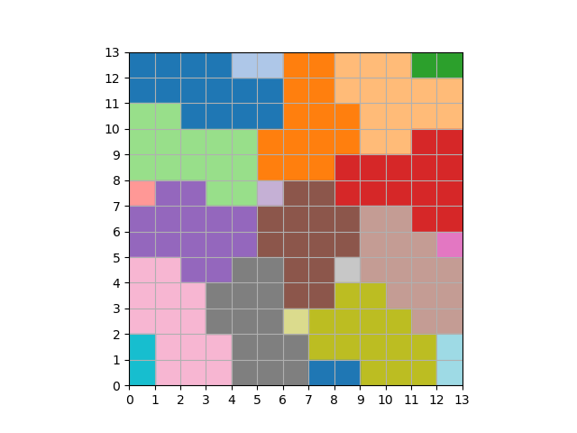
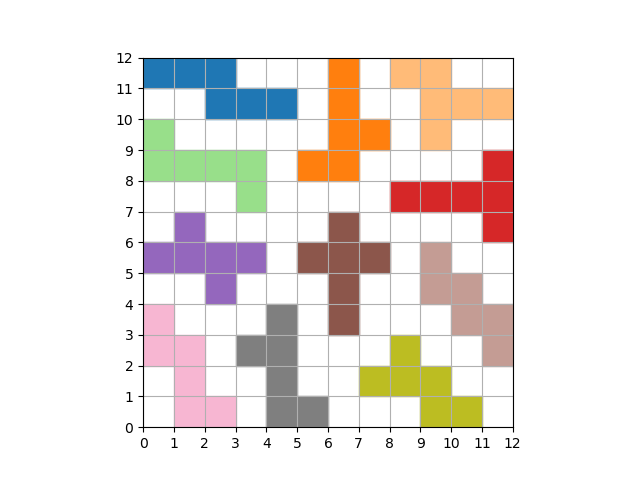
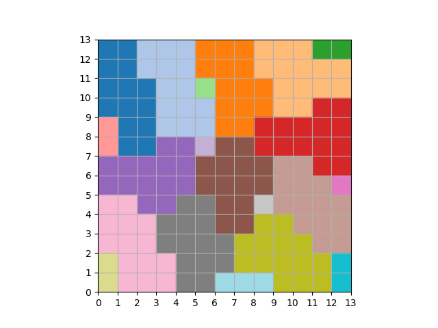
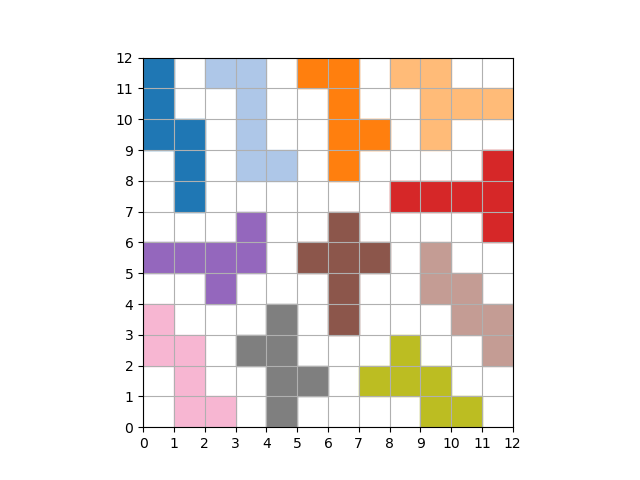
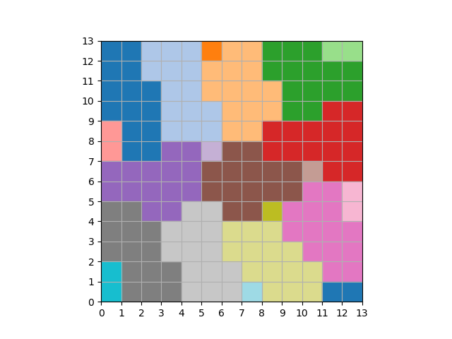
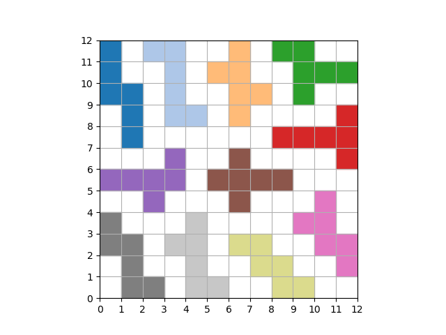
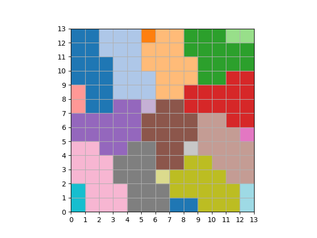
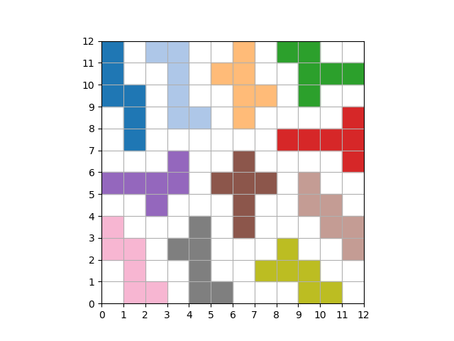
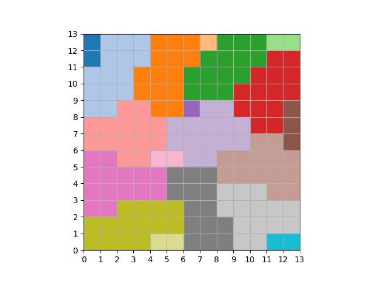
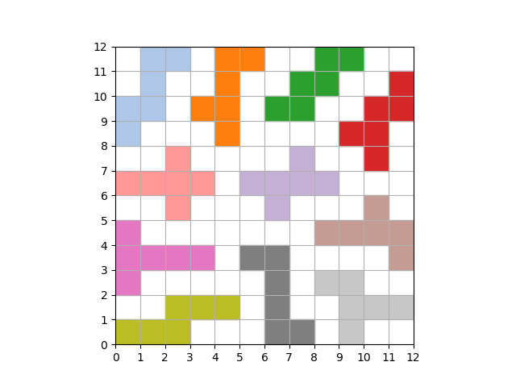